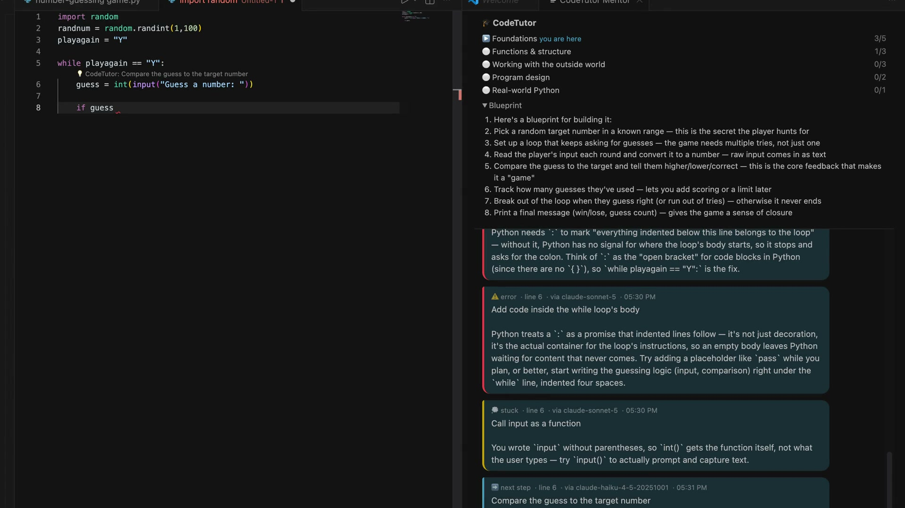
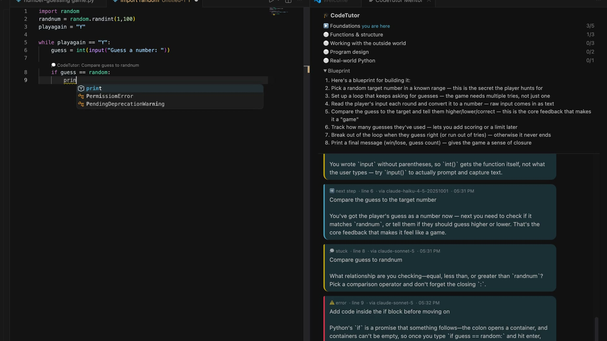

# CodeTutor Mentor

> A working, local-first prototype exploring whether an AI coding assistant can optimize
> for learner independence instead of code-generation speed.

An **in-editor pair-programming mentor**. You drive the keyboard; it rides along and
teaches in the flow of building — a *genie inside your editor*, not a standalone app
and not a code generator.

> **Why I built this.** Most "AI for coding" tools either write the code for you or
> lecture you about it — neither is how people actually get good. You learn by building
> real things with someone experienced explaining *why* over your shoulder, and getting
> quieter as you improve. I wanted to build that: a mentor that lets you drive, explains
> in context, and — critically — *remembers what you already know* so it stops repeating
> itself and adapts when you keep making the same mistake. The interesting engineering
> isn't the LLM call; it's the **learner model** that decides when, what, and how much to
> explain.

## Who this is for

People who want to **actually learn to code**, not just ship code faster:

- Beginners and self-taught developers who want to understand *why*, not copy-paste.
- Students and bootcamp learners who want a patient tutor in their editor.
- Anyone worried they're becoming dependent on AI autocomplete and want to rebuild real skill.
- Educators and teams onboarding junior developers.

If your goal is to *finish a task as fast as possible*, a code-generation tool is the
right choice. If your goal is to *get good*, this is built for you.

## How it's different from Copilot / Cursor / Claude Code

Those tools optimize for **productivity** — get working code out the door, ideally written
by the AI. CodeTutor optimizes for **learning** — *you* write every line, and the mentor
teaches in the flow. Same editor, opposite goal.

| | Coding assistants (Copilot, Cursor, Claude Code) | **CodeTutor** |
|---|---|---|
| **Goal** | Ship code fast | Help you understand and improve |
| **Who types the code** | Often the AI | Always you |
| **When it speaks** | Autocompletes constantly | Only when it adds value; fades as you improve |
| **Learning model** | Usually task/context memory | Tracks evidence of concepts practiced and recurring mistakes |
| **On mistakes** | Fixes them for you | Explains the concept; changes approach if you repeat it |
| **Direction** | You ask, it answers | Suggests a learning path and next projects |

Think of coding assistants as a **power tool** for people who already know how to build,
and CodeTutor as a **driving instructor** — you stay at the wheel, it coaches, and its
whole job is that you can do it yourself next time.

It does several things, each triggered by a moment while you code:

| Trigger | When it fires | What you get |
|---|---|---|
| **Blueprint** | You state a goal | A short, ordered plan (steps, not code) it then tracks |
| **Next-step hint** | You finish a line (after a short pause) | One nudge toward the next move, *with the reasoning why* |
| **Error coach** | The parser finds a typo/syntax error | What's wrong, the fix, and *why* Python rejects it |
| **Context correction** | Valid Python is placed where it cannot behave as intended | What is misplaced, where it belongs conceptually, why Python behaves that way, and one next action |
| **Stuck nudge** | You go idle ~10s (esp. on an unfinished line) | A gentle guiding question — "what's iterable after `for i in`?" |
| **Explain (curiosity payoff)** | You say "Yes" to a first-use prompt | A real ~30-second explanation of the concept/library |
| **Why is this here?** | You hover a line/token (or run the command) | What it does, why it's needed here, and what breaks without it |
| **Ask the mentor** | You type a question in the chat panel | A free-form answer grounded in your code and goal |

The side panel is an **interactive chat**: mentor hints stream in as bubbles (with the
blueprint and learning-path progress in the header), and a box at the bottom lets you ask
the mentor anything about your code — answered inline in your context.

Inside a Python editor, right-click a line (or open its quick fixes) to choose
**CodeTutor: Ask about this line** or **CodeTutor: Why is this line here?**. Automatic
completed-line hints are anchored to the edited line, while full explanations remain in
the side panel.

It also has a **curiosity meter** (offers a 30s explanation the first time you use a new
library/function) and **fades over time** (gets quieter as your hint count grows).

### Help while forming a condition

If a learner pauses halfway through an `if`, `elif`, or `while` condition, the stuck
coach explains the decision behind the operator rather than completing the expression.
It distinguishes exact matches, boundaries, combined requirements (`and`), alternatives
(`or`), membership (`in`), and valid truthiness checks. When intent is unknown, it asks
what yes-or-no question the learner wants Python to answer.

## Demo

▶️ **[Watch the 79-second AI learning journey](docs/CodeTutor-AI-Learning-Journey.mp4)**

The latest walkthrough follows the complete loop: choose a model provider and teaching
level, enter the AI Engineer & AI Expert journey, receive a beginner-friendly blueprint,
get guidance at the line where progress stalls, correct a logic mistake, verify the
working program, and continue directly into the next AI lesson. Current guidance remains
prominent while earlier explanations stay available in a separate history drawer.

For a shorter look at condition coaching, see the original
**[45-second in-editor demo](docs/CodeTutor-demo.mp4)**.

### Guidance that explains, not just corrects

When a learner pauses midway through a condition, CodeTutor identifies the precise
line, explains why Python needs a complete yes-or-no question, and gives a useful next
step without writing the answer for them.



### Coaching that follows the learner's progress

As the learner continues, the mentor recognizes what changed, asks a focused question
about intent, and explains structural mistakes in plain language. The learner stays at
the keyboard and makes each decision.



A real session building a weather app (goal → you type → it teaches):

```
Goal: a weather app that fetches the temperature for a city

🗺️  BLUEPRINT
    1. Pick and import the libraries you'll need — so Python has the tools it lacks.
    2. Get the raw data (call the weather API) — nothing works without input.
    3. Turn the response into a usable structure — so you can read values easily.
    4. Print the result — the payoff of the goal.

you type ▸ import requests
➡️  NEXT STEP — You imported `requests`. Next you'll define the input it works on
    (the API URL), because a library needs something to act on.
    💡 First time using requests — want a 30-second explanation of why it exists?

you type ▸ improt requests          (typo)
⚠️  ERROR COACH — Looks like a typo of `import`. Python only recognizes the exact
    keyword `import`; anything else is treated as a name it doesn't know, so it
    throws a SyntaxError. Fix it to `import ...`.

you type ▸ for i in                  (then pause ~10s)
💭  STUCK NUDGE — A `for ... in` loop needs something *iterable* on the right — a
    list, string, or range. Which collection from your plan holds the cities?

you ask  ▸ what's the difference between get and post?
💬  ANSWER — `get()` retrieves data (reading the weather), `post()` sends new data
    to a server. Since you're only reading, `get()` is the right call here.

── after you use loops cleanly a few times ──
➡️  NEXT STEP — You've got loops down — I'll stay out of the way here. Move on to
    the next blueprint step.
```

The mentor got quieter after repeated clean evidence of loop usage, and it flagged the
repeated `import` typo as a recurring misconception. Both behaviors come from the
persistent learner model rather than an LLM judgment. This is a heuristic demonstration,
not a validated measure of learning or mastery.

### The learner model (the central product hypothesis)

The mentor keeps a **persistent, per-learner model** of observed practice — not a claim
that it can prove what someone knows. It stores concept-by-concept heuristic states such
as mastered / practicing / struggling, plus **recurring
misconceptions**. Every prompt is filtered through it, so it stops re-explaining what
you've mastered and *changes strategy* (not volume) when you make the same mistake
repeatedly.

- **Concept detection** is deterministic (AST) — loops, dicts, recursion, async,
  functions, HTTP, etc. The prototype labels a concept *mastered* after repeated clean
  appearances; that threshold is a tunable proxy, not an educational assessment.
- **Misconception recurrence** — the same typo/mistake three times flips it to a
  "recurring misconception," which triggers a different, deeper explanation.
- **Storage is local SQLite** (`~/.codetutor/learner.db`) so learner data stays on the
  machine. Shared deployment is intentionally out of scope until authentication,
  retention, isolation, and consent controls are designed.

Try it: run the demo twice — a concept gets mastered and the mentor backs off, a repeated
typo gets flagged, and the profile persists across runs.

### The learning path (don't know what to build?)

When you start a session, CodeTutor first separates **teaching depth** from **learning
journey**. Learners can choose General Python or the AI Engineer & AI Expert journey,
then receive project goals **tailored to that choice and entry level**. A beginner who
chooses AI starts with the Python foundations AI systems depend on; intermediate and
advanced learners can enter through later stages without hiding the complete journey.
A structured general curriculum (Foundations → Functions → Working with the outside
world → Program design → Real-world Python) maps each level to concepts;
the mentor finds your current level from the learner model and proposes projects that
exercise the concepts you *haven't* mastered yet. As you master them, the suggestions move
you up the path — a step-by-step route toward expert. The side panel shows your progress
per level. All deterministic, so it works offline (`GET /suggest-goal?learner_id=...`).

### Resume, verify, and move forward

CodeTutor stores the active lesson locally alongside the learner model: goal, teaching
level, blueprint, current and completed steps, check evidence, file association, and last
activity time. Restarting VS Code or the mentor service offers **Continue lesson** instead
of silently resetting the learner to step one. The saved code value is a short fingerprint
rather than a second copy of the source; the current file is evaluated again on return.

Guided projects expose **Run lesson check** in the mentor panel and Command Palette.
Completion is deterministic: project-specific checks must pass, the Python must parse,
and the learner must confirm that they exercised the program successfully. The LLM does
not award completion. A passing lesson presents **Next lesson** and **Review what I
learned**, while retaining the learner's broader progress.

## Architecture

```
┌────────────────────┐   HTTP    ┌───────────────────────┐   HTTP    ┌──────────────────────┐
│  VS Code extension │ ────────► │  Python mentor service │ ────────► │  LLM (OpenAI-        │
│  (thin: eyes/mouth)│           │  (the brain)           │           │  compatible endpoint)│
│  • edit/idle/action│ ◄──────── │  • blueprint + state   │ ◄──────── │  or a private        │
│  • inline hints    │  message  │  • linter (typos)      │  reply    │  gateway             │
│  • side panel      │           │  • LLM reasoning       │           └──────────────────────┘
└────────────────────┘           └───────────────────────┘
```

- **The editor is a client** — it runs on each laptop, detects triggers, renders hints.
  It holds *no* intelligence.
- **The Python service is the brain** — blueprint, lesson-plan state, curiosity meter.
  The cheap deterministic layer (Python's own parser) finds typos/syntax errors; the
  **LLM is reserved for open-ended teaching** (blueprint, next-step reasoning, nudges,
  phrasing error explanations). This keeps it fast, cheap, and accurate.
- **The LLM is config-driven** — use Anthropic directly or point `OPENAI_BASE_URL` at
  an OpenAI-compatible endpoint that your environment permits.

See [ARCHITECTURE.md](ARCHITECTURE.md) for the full design and deployment notes.

## Key design decisions

These are the tradeoffs I made deliberately — the "why," not just the "what."

**The LLM provider is replaceable; the learner model is the product hypothesis.** Calling an
API. The differentiator is a persistent, per-concept model of the learner that filters
every response — so it stops explaining what you've mastered and *changes strategy* (not
volume) when you repeat a mistake. That's where the effort went.

**Two layers, split on purpose.** A cheap deterministic layer (Python's own parser)
handles what parsers do better than any model — finding typos, judging whether a line is
finished, extracting concepts. The LLM is reserved for open-ended teaching. Routing every
keystroke through a model would be slow, expensive, and would hallucinate syntax rules;
this split avoids all three.

**Multi-provider, switchable at runtime.** `llm.py` supports **Anthropic (Claude)**
natively (Messages API) *and* any **OpenAI-compatible** endpoint (OpenAI, Azure, Ollama,
private gateways) — both can be configured at once. Each request is routed to the right
provider by model name (`claude*` → Anthropic, else OpenAI), and the learner can switch
models mid-session from the editor ("CodeTutor: Change model") with no restart. The OpenAI
path also self-heals across API generations (adapting `max_tokens`/`max_completion_tokens`
and `temperature` for 4o vs GPT-5.x/o-series).

**Automatic failover.** With both provider keys set, a failed request on the primary
model (timeout, empty response, error) is automatically retried on the other provider —
so a flaky or slow model doesn't break the session. Configurable via `MENTOR_FAILOVER`
and `MENTOR_FALLBACK_MODEL`/`MENTOR_FALLBACK_FAST`; a manual "Change model" choice opts
out (your explicit pick is respected).

**Per-task model routing.** Not every call needs the flagship model. The high-frequency,
low-stakes next-step hints use a cheap/fast model (`MENTOR_MODEL_FAST`), while the rare,
high-value teaching (blueprint, stuck nudges, explanations, "why is this here?",
misconception reframes) uses a stronger model (`MENTOR_MODEL`). This keeps latency and cost
sane without dulling the teaching where it matters.

**Prompt caching.** The stable system prompt can be marked cacheable for Anthropic;
compatible providers may apply their own prefix-caching behavior. Actual cost and latency
depend on provider terms, model, cache eligibility, and workload. Toggle with
`MENTOR_PROMPT_CACHE`.

**Offline mode as a first-class citizen.** With no API key the whole loop runs on
deterministic mock responses. This makes the project runnable in seconds, keeps the test
suite hermetic (no network, no cost), and cleanly separates "do the mechanics work" from
"is the teaching good."

**Thin client, thick brain.** The VS Code extension holds zero intelligence — it only
detects triggers and renders replies. All logic lives in the Python service, which keeps
the hard part testable and portable to any editor later.

## Testing

The deterministic layer is covered by a hermetic pytest suite (no network, no LLM):

```bash
cd mentor-service
pip install pytest
pytest                 # 150 tests: lesson resume/checks, semantic validation,
                       # quiet interventions, safe fixes, learner-model persistence
```

The current tests validate deterministic mechanics, not learning effectiveness. A useful
product evaluation must additionally measure hint relevance, interruption rate, learner
retention, task completion without generated code, and behavior across skill levels.

## Quick start

> **New to terminals or VS Code extensions?** Follow the complete
> **[beginner setup guide](BEGINNER_SETUP.md)**. It explains every prerequisite,
> provides separate macOS/Linux and Windows commands, shows what successful output looks
> like, and includes fixes for the most common setup errors.

CodeTutor currently runs from source rather than the VS Code Marketplace. The shortest
macOS/Linux setup is:

```bash
cd ~/Downloads
git clone https://github.com/adarshsharma-ops/CodeTutor.git
cd CodeTutor/mentor-service
python3 -m venv .venv
.venv/bin/python -m pip install -r requirements.txt
cp config.example.env .env
bash run_server.sh
```

Keep that terminal open. In a second terminal:

```bash
cd ~/Downloads/CodeTutor/extension
npm install
npm run compile
```

Open the `CodeTutor/extension` folder through **VS Code → File → Open Folder**, then press
**F5**. Do not open the outer repository folder, and do not rely on the optional `code`
terminal command. The first-run screens configure OpenAI, Anthropic, or local Ollama and
then start the learning journey.

At the start of each session, choose how CodeTutor should teach:

- **Beginner** leads with the concrete next action, its purpose, and plain-language help.
- **Intermediate** recommends an approach while exposing useful implementation choices.
- **Advanced** emphasizes deeper principles, trade-offs, architecture, testing, and design.

The level is a session preference, not a permanent label, and can be changed from the
Command Palette with **CodeTutor: Change teaching level**.

### 1. Feel the brain (zero setup, no LLM needed)

```bash
cd mentor-service
python3 demo_cli.py            # replays a session; shows the learner model evolving
```

Runs in **offline/mock mode**. To use a real model, put a key in `.env` — either
`ANTHROPIC_API_KEY` (Claude, the default) or `OPENAI_API_KEY` (see `config.example.env`).

### 1b. Judge teaching quality (the important one)

```bash
python3 eval_harness.py --out report.md          # offline baseline
# then, with a real model configured:
python3 eval_harness.py --out report_llm.md      # real explanations to read critically
```

Prefer not to use a cloud key? CodeTutor also supports **keyless local models through
Ollama as an experimental option**. Local privacy and zero API cost do not guarantee good
tutoring: smaller models may misunderstand intent or give weaker explanations. The
first-run chooser makes that trade-off visible. See the
[provider setup guide](docs/PROVIDER_SETUP.md) for local Ollama, OpenAI, and Anthropic
instructions. Cloud keys stay in the ignored local `mentor-service/.env` file; never put
them in VS Code settings, source code, issues, or chat.

The harness runs every behavior — blueprint, next-step, error, stuck, **explain**
(curiosity payoff), and **why-is-this-here** — across scenarios and writes a Markdown
report. This is how you answer "is the mentoring actually good?" and tune `prompts.py`.
The [tutor reliability guide](docs/TUTOR_RELIABILITY.md) explains the deterministic
checks, progressive-hint policy, stale-response protection, and limits of this gate.

### 2. Run the service

```bash
cd mentor-service
pip install -r requirements.txt
cp config.example.env .env      # add your key + endpoint (or leave blank for offline)
./run_server.sh                 # serves on http://127.0.0.1:8756
```

### 3. Run the extension

```bash
cd extension
npm install
npm run compile
```

Then open the `extension` folder in VS Code and press **F5** to launch an Extension
Development Host (VS Code 1.93 or newer). Run **CodeTutor: Start a new learning journey**
from the Command Palette; CodeTutor offers to create the Python lesson file or use the
current one.

## Repository layout

```
CodeTutor/
├── mentor-service/          # Python "brain" (stdlib-only core; FastAPI for the service)
│   ├── mentor/
│   │   ├── config.py        # config-driven LLM wiring
│   │   ├── llm.py           # OpenAI-compatible client (+ offline mode)
│   │   ├── analyzer.py      # deterministic: syntax/typo + line-completeness + CONCEPT detection
│   │   ├── learner_model.py # persistent per-learner model (mastery + misconceptions), SQLite
│   │   ├── prompts.py       # the teaching philosophy, as prompts (profile-filtered)
│   │   ├── state.py         # session / blueprint / curiosity-meter state
│   │   ├── mentor.py        # orchestrates the four behaviors
│   │   └── server.py        # FastAPI: /session, /event, /health, /learner/{id}/profile
│   ├── tests/               # hermetic pytest suite (no network/LLM)
│   ├── demo_cli.py          # replay harness — feel the mentor with no editor
│   ├── eval_harness.py      # run every behavior across scenarios -> Markdown report
│   ├── check_llm.py         # one-call connectivity smoke test
│   ├── requirements.txt
│   └── config.example.env
├── extension/               # VS Code extension (thin client)
│   ├── package.json
│   └── src/{extension,client,panel}.ts
├── BEGINNER_SETUP.md        # first-time installation and troubleshooting
├── LICENSE                  # MIT
└── ARCHITECTURE.md
```

## Status

This is a working **open-source prototype** of the full learning loop: provider onboarding,
level- and pathway-aware projects, proactive in-editor guidance, persistent lesson state,
deterministic lesson verification, and progression into the next project. The mentor
service is covered by hermetic tests and the VS Code extension compiles from source.

It is not yet a validated educational assessment or a packaged Marketplace extension.
Teaching quality still depends on the configured model, and local models should be judged
with the included evaluation harness before relying on them. Next steps are in
ARCHITECTURE.md.

## Privacy and security

Code is sent to the configured mentor service for automatic completed-line and idle
events. When a real model is configured, the service includes code context in model
requests. Do not use the prototype with confidential, regulated, proprietary, or
third-party code unless the endpoint and data handling are explicitly approved.

Hover-triggered model calls are disabled by default because moving a pointer is not an
adequate disclosure action. The explicit **CodeTutor: Why is this line here?** command is
the privacy-conscious alternative. Learner history is stored locally in
`~/.codetutor/learner.db`; use the reset endpoint or delete that local file to erase it.

The HTTP service has no authentication and is intended to bind to localhost only. Do not
expose it to a network. See [SECURITY.md](SECURITY.md) for the threat model, supported-use
boundary, and responsible disclosure guidance.

## Product questions and roadmap

The next milestone is evidence, not feature volume:

1. Run structured teaching-quality evaluations with beginner, intermediate, and expert
   scenarios.
2. Measure false interruptions and let learners tune or pause proactive coaching.
3. Replace repeated AST appearances with stronger evidence of concept understanding.
4. Add transparent learner-profile controls: inspect, correct, export, and delete.
5. Add extension tests and CI for Python tests, TypeScript compilation, and secret scans.
6. Only then consider more languages or a shared service with authentication and tenancy.

## Teaching contract

CodeTutor is designed for learners, including people seeing programming terminology for
the first time. A useful intervention should explain **what** the tutor noticed, **where**
it happens, **why** Python behaves that way, **what idea belongs there instead**, and
**how** to take one small next step. It should explain an idea in ordinary language before
naming the technical term, avoid shame, and avoid taking the keyboard away from the
learner.

The first contextual-correction checks deliberately cover only high-confidence patterns:
numbers or collections accidentally reset inside a loop, an unconditional `return` that
prevents a loop reaching its second item, and statements that cannot run after control has
already left a block. When the learner removes the detected pattern, CodeTutor asks them
to explain why the correction works; this retrieval step is intended to strengthen the
mental model instead of rewarding a mechanical edit. Broader logical and intention-based
diagnosis remains a roadmap area and must be evaluated carefully to avoid confident but
incorrect assumptions.

For intent-dependent placement, CodeTutor asks instead of accusing. For example, printing
a loop-produced value after the loop may correctly mean “show only the final result,” or
it may be an indentation mistake when the learner wants one result per item. The tutor
explains both behaviors and asks which outcome the learner intended. It also detects the
conservative runtime case where a function reads a local name before its later assignment.

## Open-source learning vision

The current release offers a Python foundation journey and an opt-in AI Engineer & AI
Expert journey. The AI journey is a structured curriculum and routing capability—not a
claim that completing projects alone proves professional expertise. The near-term north
star remains an excellent Python mentor
that helps a learner build understanding and independence instead of generating finished
solutions.

Each current curriculum level now exposes structured prerequisites, observable evidence,
common mistakes, and understanding-check questions. This is the foundation for modular
learning pathways; it is not yet a complete course or an educational-outcomes claim.

Contributions are welcome under the standards in [CONTRIBUTING.md](CONTRIBUTING.md).
Teaching features must include deterministic evidence where possible, counterexamples,
tests, beginner-readable explanations, and evaluation scenarios. CI runs the Python test
suite, compiles the extension, and scans repository history for secrets.

### Versioned Python Foundations pathway

The first data-driven pathway lives at
`mentor-service/curricula/python-foundations/v1/manifest.json`. It currently covers:

1. Values and variables
2. Decisions
3. Collections and loops
4. Functions
5. Errors, files, and modules

Every module declares prerequisites, analyzer concepts, a plain-language mental model,
observable evidence, common mistakes, understanding questions, and projects. The service
validates the catalog at startup and exposes `GET /curriculum` and
`GET /curriculum/modules/{module_id}`. This is curriculum infrastructure plus a structured
foundation pathway and local lesson check/resume loop; it is not a formal assessment
system or an educational-outcomes claim.

### Python for Data pathway

`mentor-service/curricula/python-for-data/v1/manifest.json` adds the bridge from core
Python toward ML/AI work:

1. Rows, columns, and DataFrames
2. Loading and inspecting CSV/JSON data
3. Selecting and filtering
4. Cleaning and validating
5. Grouping and summarizing
6. Combining datasets
7. Visualizing and communicating

The analyzer recognizes initial evidence for pandas/Polars imports, structured-data
loading, missing-data operations, aggregation, and plotting. This recognition shows that
an operation appeared; it does not prove the learner chose it correctly. The curriculum's
understanding questions and future validators must establish that reasoning.

Use `GET /curricula` to discover pathways and `GET /curricula/{catalog_id}` to retrieve a
specific versioned catalog.

### Machine Learning Foundations pathway

`mentor-service/curricula/ml-foundations/v1/manifest.json` provides the first applied-ML
pathway:

1. Frame the prediction problem
2. Features, labels, and baselines
3. Train/test separation
4. Leakage-safe preprocessing
5. Training and prediction
6. Metrics and error consequences
7. Overfitting and cross-validation
8. Interpretation, intended use, and limitations

The analyzer recognizes initial scikit-learn evidence such as `train_test_split`, `fit`,
`predict`, common metrics, cross-validation, and interpretation calls. Seeing an operation
does not establish that the experimental design is valid. The pathway therefore requires
plain-language reasoning about availability at prediction time, test-set isolation,
baseline value, error costs, generalization, and unsupported uses.

### AI Engineer & AI Expert pathway

`mentor-service/curricula/ai-engineer/v1/manifest.json` is an opt-in end-to-end journey:

1. Python foundations for AI
2. Data and model thinking
3. Dependable LLM applications
4. Retrieval-augmented generation
5. Agents, tools, and controlled workflows
6. Evaluations, safety, and governance
7. Deployment, observability, and production operations

Beginner mode enters at Python for AI and explains why each foundational construct will
matter later. Intermediate mode enters at data and model thinking. Advanced mode enters
at LLM application engineering while leaving earlier modules visible for reference. Each
stage includes mental models, observable evidence, common failure patterns, understanding
checks, and sanitized projects. Advanced AI completion still requires stronger
project-specific evaluators before CodeTutor can make any assessment claim.

## What this project demonstrates

CodeTutor is deliberately framed as a product and architecture experiment. It demonstrates
problem selection, user segmentation, deterministic-versus-generative system boundaries,
provider abstraction, privacy-aware defaults, evaluation thinking, and explicit trade-offs.
It does not claim production scale, proven educational outcomes, or enterprise readiness.

AI-assisted development was used during implementation and review. Product intent,
architectural direction, trade-off decisions, integration, testing, and release decisions
remain human-owned responsibilities.
